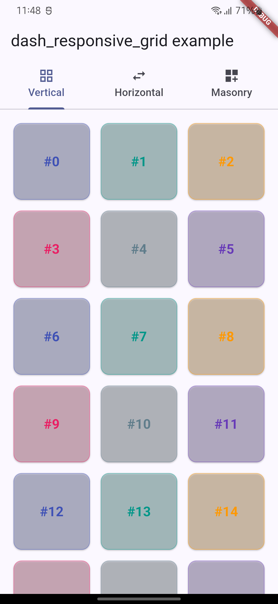
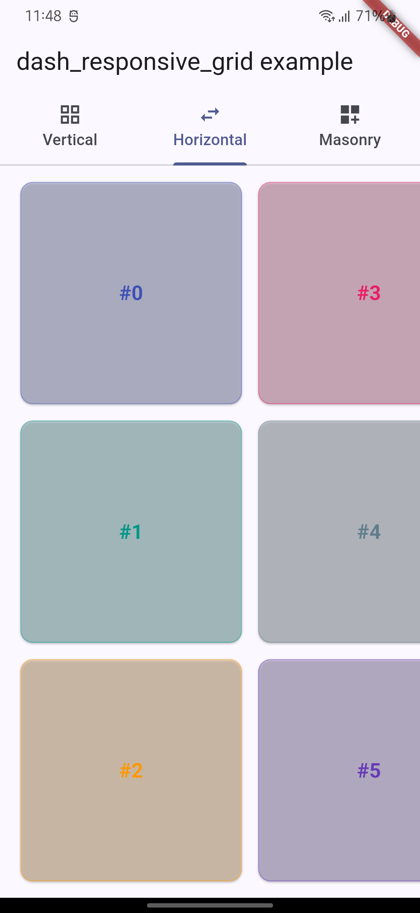
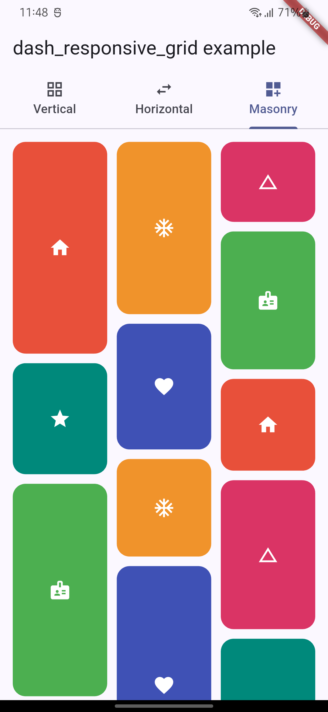

[](https://www.dashstack.tech/)

# dash_responsive_grid

A Flutter grid that picks its own column count from screen width — no `LayoutBuilder`, no breakpoint math. Includes a staggered ("masonry") layout for unevenly sized tiles. Zero dependencies.

| Vertical | Horizontal | Masonry |
|---|---|---|
|  |  |  |

## Install

```yaml
dependencies:
  dash_responsive_grid: <latest_version>
```

## Usage

```dart
import 'package:dash_responsive_grid/dash_responsive_grid.dart';

ResponsiveGridView.builder(
  itemCount: items.length,
  minColumnWidth: 160,        // columns auto-fit to width
  itemBuilder: (context, index) => MyCard(items[index]),
)
```

Prefer fixed breakpoints instead? Pass `breakpoints: GridBreakpoints.defaultBreakpoints` (mobile: 2 cols, tablet: 4, desktop: 6, web: 8) or your own `GridBreakpoints(...)`. Neither given → defaults kick in automatically.

### Loading / empty / error

```dart
ResponsiveGridView.builder(
  itemCount: items.length,
  minColumnWidth: 160,
  isLoading: isLoading,
  hasError: hasError,
  itemBuilder: (context, index) => MyCard(items[index]),
)
```
Built-in spinner / "No items" / error message — override with `loadingBuilder`, `emptyBuilder`, `errorBuilder`.

### Horizontal scroll

```dart
SizedBox(
  height: 260,
  child: ResponsiveGridView.builder(
    itemCount: items.length,
    scrollDirection: Axis.horizontal,
    minRows: 2,
    maxRows: 2,
    itemBuilder: (context, index) => MyCard(items[index]),
  ),
)
```

### Masonry (staggered) layout

Items keep their own natural height instead of a uniform tile size — each
is packed into whichever column is currently shortest:

```dart
ResponsiveMasonryGridView.builder(
  itemCount: items.length,
  minColumnWidth: 160,
  itemSpacing: 12,
  rowSpacing: 12,
  itemBuilder: (context, index) => MyCard(items[index]),
)
```

Same column-count resolution (`minColumnWidth`/`breakpoints`), spacing,
padding, and loading/empty/error handling as `ResponsiveGridView`. Layout
is eager (every item is measured to compute its placement), so it's a
good fit for a feed or gallery section — not for very long or infinite
lists; use `ResponsiveGridView` for those.

## Key parameters

| Parameter | What it does |
|---|---|
| `minColumnWidth` / `breakpoints` | pick a column-count strategy |
| `minColumns` / `maxColumns` | clamp column count |
| `minRows` / `maxRows` | same, but for horizontal scroll |
| `itemSpacing` / `rowSpacing` | gaps between tiles |
| `childAspectRatio` | tile width/height ratio |
| `isLoading` / `hasError` / `loadingBuilder` / `emptyBuilder` / `errorBuilder` | state handling |
| `scrollDirection` | `Axis.vertical` (default) or `Axis.horizontal` |

Full list in the dartdoc on `ResponsiveGridView` / `ResponsiveMasonryGridView`. Runnable demo: [`example/`](example/).

## Bugs & Credits

Report bugs and ask questions on [GitHub Issues](https://github.com/Androidsignal/dash_responsive_grid/issues). Maintained by [Dashstack Infotech, Surat](https://www.dashstack.tech/).
